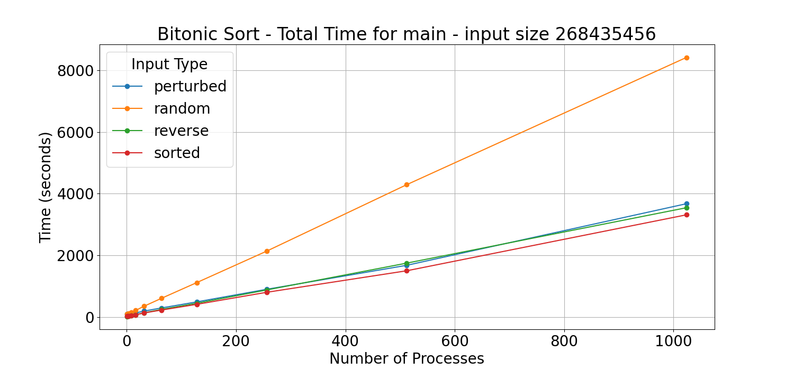
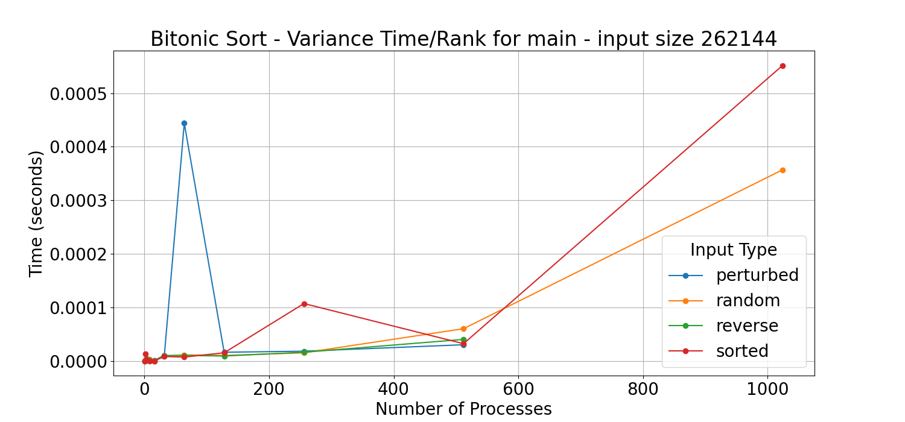
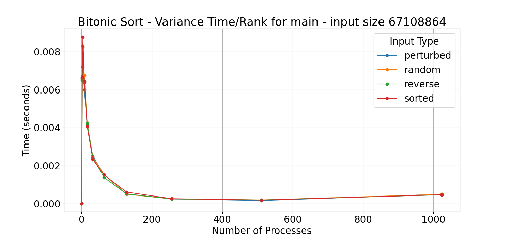
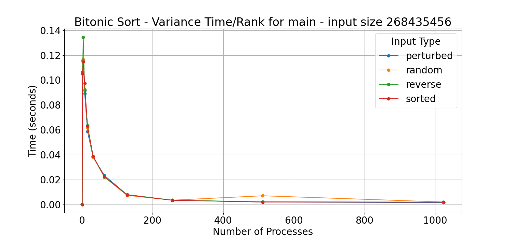
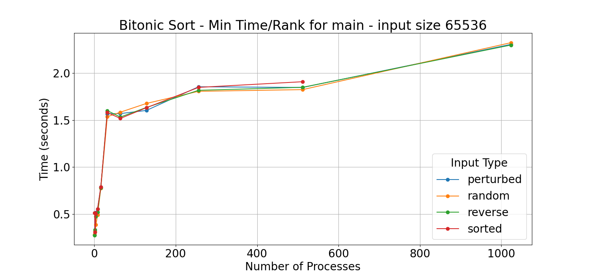

# CSCE 435 Group project

## 0. Group number: 
Group 16

## 1. Group members:
1. Jaesun Park
2. Kelvin Zheng
3. B.J Min
4. Allen Zhao

Team Communication Method: Discord

## 2. Project topic (e.g., parallel sorting algorithms)

### 2a. Brief project description (what algorithms will you be comparing and on what architectures)

- Bitonic Sort:
    Bitonic sort is a divide and conquer algorithmm that does well with a prallel implementation. Bitonic sequences are sequences that change between increasing and decreasing only once. Bitonic sort repeatedly divides the data into halves and thenthen does comparisions to determine whether to swap elements in order to transform the data into bitonic sequence. It then combines these bitonic sequences into strictly increasing or decreasing sequences. The algorithm utilizes collective communication to divide up the starting array among processes and combine arrays from processes into the final array. It also utilizes point-to-point communication when two "partnered" processes are comparing values. This algorithm uses SPMD (Single program, multiple data) as its parallelization strategy.

- Sample Sort:
    Sample sort is a generalization of quicksort designed for parallelized processing. It takes a sample size of s from the original data. It sorts that chosen sample and then divides the sorted sample into p equal-sized groups called 'buckets'. (p is generally chosen as the number of available processors) Then you take p-1 elements from the sorted sample to be 'pivot' values that are used to determine the bucket ranges. Then partition the original data into p buckets with the value in each bucket being in the range between two pivot values. Sort each bucket and then merge them all together. Depending on the size of subarrays, we would either run a simpler sorting algorithm or recursively sample sort them until the remaining subarrays are small enough to be sorted via a simpler sorting algorithm.
    
- Merge Sort: 
    Merge sort is a form of sorting algorithm that uses the divide and conquer methodology to sort data by repeatedly dividing itself into halves until it consist one element, merging them back together in a sorted manner.
    To implement a parallel version of merge sort using MPI, dividing the sorting task across multiple processors.
    The idea is for the parent processor to divide the array into x subarrays (depending on how many processors are being used)
    and send them to the workers. The workers will then take that subarray, apply merge sort, and send it back to the master. The master process will then take and merge all the sorted subarrays.

- Radix Sort:
    Radix Sort is a non-comparative sorting algorithm that processes integers by grouping them based on individual digits, starting from the least significant digit to the most significant.
    It sorts numbers by distributing them into "buckets" corresponding to each digit, performing this for each digit position in sequence.
    The algorithm can work with any base (e.g., binary, decimal) and uses counting sort as a subroutine to handle sorting at each digit. Parallel implmentation of radix sort will be done with MPI, which splits the workload across multiple processors.
    The unsorted array will first be distributed across processors, then each process carries out a digit-wise sort locally, followed by a global prefix-sum to determine where each bit should be placed globally, redistribute those bits, and then finally gather the sorted chunks back to the master process. 

#### Source code Descriptions
- Bitonic Sort
    The implementation of the Bitonic Sort algorithm utilizes parallelization and MPI. The code first initializes all necessary tools like Caliper and MPI. It then initializes the array according the command line arguments that specify details like array size and type. From there, it uses `MPI_Scatter` to distributed the array among the multiple processes. Each process then sorts their array data locally. From here, Bitonic sort is then utilized to combine these sorted arrays into one large array. Phases will have increasing number of processes in each 'group' with the first group being size 2 and it being doubled each time. Then within each larger phase (which is demarked by starting group size), there are smaller phases where subgroups are formed starting at the starting group size and halving each time. Given the size of the outer and inner phase, the step size is calculated which is then used by a process to determine its partner processes. From this point, the phase and process rank is used to determine whether the paired processes should be ascending or descending. Then `MPI_Sendrecv` is used to have paired processes shared their local array data with each other. Now given the process rank, phase, and whether they should be ascending or descending, the process either grabs the greater half or lower half of the data in the two processes's local arrays by iterating through them. From this, the data is redistributed into two new ascending arrays between the two paired processes. This process is continually repeated until all data from all processes are merged together into one ascending array. From there, all the local results are gathered back together at rank 0 using `MPI_Gather`where correctness is thenn checked. 

- Sample Sort:
    The Sample Sort implementation begins by taking in the parameters from the command line and then parses them to set up the initial variables for the sorting algorithm to use. Then the code generates the initial array in the Master process by using the imported `generateArray` function from "data.cpp". Then the code uses `MPI_Scatter` to send a chunk of the initial array to each process and then sorts those chunks locally. Then it uses the sorted chunks to select pivot or splitter values from before using `MPI_Bcast` to send the pivots to each process. Once the processes have received the pivot values, the code then calculates the appropriate buckets and the elements in each bucket based on the pivot. Then the code moves on to preparing the send and receive buffers to combine all the buckets into the final array. In preparation for the send and receive buffers, the code has to calculate the displacements of the send and receive buffers to identify each bucket since all the buckets will be merged into one array at the end. So the receive buffers need to know where each bucket starts when the buckets are sent. Once the final receive buffers have got their data, the `MPI_Gatherv` function combines all the data from all processes into one final array. Finally the final array is checked for correctness before sending a confirmation message that the array is sorted.


- Merge Sort:
    The implementation of the Merge sort algorithm utilizes MPI to parallelize the sorting process across multiple processors. The general idea here is to divide the input array into the number of processors being used, sort each subarray in parallel and merge them back together at the end. The code initially starts with initializing MPI, setting up the number of processors and identify the ranking of each processor- the master process is responsible for distributing the data, collecting the sort arrays and merging them together. After initializing MPI, it generates the data from "data.cpp" based on the parameters from the mpi.grace_job script. Afterwards, the master process will divide the array into chunks (based on the number of paramters) and distribute them to each worker using `MPI_Send`. On the other hand, the worker will receive the data with `MPI_Recv`. After the worker threads get their own subarrays, it will then do a local sort within that subarray using the merge sort algorithm. Then, it will send the sorted subarray back to the master, where the master will collect them, and use the `mergeVectors()` function to merge the sorted arrays to ultimately have a fully sorted array. This is then checked through the correctness process, where it will check whether the algorithm has successfully sorted the array. Finally, the program calls MPI_Finalize to clean up MPI and terminate the parallel program.
- Radix Sort

### 2b. Pseudocode for each parallel algorithm
- For MPI programs, include MPI calls you will use to coordinate between processes

- Sample Sort Pseudocode:
    ```
    MPI_Init()
    int rank
    int num_procs

    procs_elems = length(data) / num_procs   # The number of elements per process
    local_data = empty array of proc_elems
        
    scatter data to processes using MPI_Scatter(local_data)
        
    sorted_local = sort(local_data)

    if rank == 0:    # i.e. MASTER
        sorted_subarrays = empty array
    
    gather sorted local data using MPI_Gather(sorted_local)

    if rank == 0:   # i.e. MASTER
        final_sorted = merge(sorted_subarrays)

    MPI_Finalize()
    ```

- Merge Sort Pseudocode:
    ```Initialize MPI
    int processor_rank // the current process id
    int processor_count // total number of processors currently being used

    if processor_rank == MASTER:
        Divide the main array into subarrays based on 'processor_count'
        for each worker:
            send subarray using MPI_Send

        sortedSubArrays = init empty array
        for each worker:
            receive subarray from worker using MPI_Recv 
            append received subArray into sortedSubArrays
        
        finalSortedArray = merge all the sortedSubArrays here
    
    else: // worker
        Receive subarray from MASTER using MPI_Recv
        Sort the subarray using MergeSort
        Send the sorted array back to MASTER using MPI_Send

    Finalize MPI
    ```

- Bitonic Sort Pseudocode:
    ```
    Int rank
    Int N // number of processes
    MPI_Init // initialize MPI for communication
    MPI_Comm_rank // get the process rank
    MPI_Comm_size // get the number of processes N
    
    If rank == 0:
      Initialize int array of size 2^x where x is an integer
      M = size(array) / N
    
    MPI_Bcast M(the size of local arrays) from rank 0 to all processes
    MPI_Scatter to distribute array data among all processes 

    array1 = array for local data of process
    sort array1

    For (int i=1; i <= N/2; i *= 2): // i = first and largest step size of current phase
      procs_per_group = i * 2
      Ascending if (rank // procs_per_group) % 2 == 0, descending otherwise
      For (int step = i; step > 0; step /= 2):
        if (rank % step) < step / 2:
          partner_rank = rank + step
        else:
          partner_rank = rank - step
          
        MPI_Sendrecv to send array1 to partner and put partner’s data in array2

        If (Ascending and rank <  partner_rank) OR (descending and rank > partner_rank):
          Iterate from left sides of array1 and array2:
            create a temp array of size m with the smallest values from array1 and array2, sorted in increasing order
          Set array1 equal to temp
        Else:
          Iterate from the right sides of array1 and array2:
            Create a temp array of size M of the largest values of array1 and array2 in increasing order
          Set array1 equal to temp

    If rank == 0:
      Merge together all local arrays from all workers using MPI_gather
      Print result array
    ```
- Radix Sort Psuedocode:
  ```
  array full_data
  array global_data
  allocate space for array local_data which holds the portion of the data for each process
  MPI_Init()
  if rank == MASTER:
      MPI_Scatter(local_data) to split the full_data and send chunks to each process
  else:
      from least significant bit to most significant bit:
          Count how many numbers have 0 or 1 in the current bit position
          for each number in the local_data chunk:
              Extract the bit at the current position for each number
          MPI_Allreduce(global_count) to sum up the local counts across all processes
          MPI_Scan(prefix_sum) to computer prefix_sums and determine where each process should start placing its numbers
  
  if rank == MASTER:
      MPI_Gather(global_data) to gather the sorted chunks back to the master process
  MPI_Finalize()
  ```

### 2c. Evaluation plan - what and how will you measure and compare

### Input Sizes / Input Types
- Varying sizes in order to test the scalability 
    - Example: 10<sup>4</sup>, 10<sup>6</sup>, 10<sup>8</sup>...
- Input types will consist of random data, sorted data, and reversally sorted arrays

### Time:
- Measure the total time taken to sort the array using different number of processors.
- Measure the time between each worker threads assuming that the worker threads are the ones sorting.

### Scalability
#### Strong Scaling
- Maintain the same problem size while increasing the number of processors to measure the time decreasing 

#### Weak Scaling
- Increase the problem size proportionally with the processors to measure the execution time whether it'll be stable or not.

### 3a. Caliper instrumentation
Please use the caliper build `/scratch/group/csce435-f24/Caliper/caliper/share/cmake/caliper` 
(same as lab2 build.sh) to collect caliper files for each experiment you run.

Your Caliper annotations should result in the following calltree
(use `Thicket.tree()` to see the calltree):
```
main
|_ data_init_X      # X = runtime OR io
|_ comm
|    |_ comm_small
|    |_ comm_large
|_ comp
|    |_ comp_small
|    |_ comp_large
|_ correctness_check
```

Required region annotations:
- `main` - top-level main function.
    - `data_init_X` - the function where input data is generated or read in from file. Use *data_init_runtime* if you are generating the data during the program, and *data_init_io* if you are reading the data from a file.
    - `correctness_check` - function for checking the correctness of the algorithm output (e.g., checking if the resulting data is sorted).
    - `comm` - All communication-related functions in your algorithm should be nested under the `comm` region.
      - Inside the `comm` region, you should create regions to indicate how much data you are communicating (i.e., `comm_small` if you are sending or broadcasting a few values, `comm_large` if you are sending all of your local values).
      - Notice that auxillary functions like MPI_init are not under here.
    - `comp` - All computation functions within your algorithm should be nested under the `comp` region.
      - Inside the `comp` region, you should create regions to indicate how much data you are computing on (i.e., `comp_small` if you are sorting a few values like the splitters, `comp_large` if you are sorting values in the array).
      - Notice that auxillary functions like data_init are not under here.
    - `MPI_X` - You will also see MPI regions in the calltree if using the appropriate MPI profiling configuration (see **Builds/**). Examples shown below.

All functions will be called from `main` and most will be grouped under either `comm` or `comp` regions, representing communication and computation, respectively. You should be timing as many significant functions in your code as possible. **Do not** time print statements or other insignificant operations that may skew the performance measurements.

### **Nesting Code Regions Example** - all computation code regions should be nested in the "comp" parent code region as following:
```
CALI_MARK_BEGIN("comp");
CALI_MARK_BEGIN("comp_small");
sort_pivots(pivot_arr);
CALI_MARK_END("comp_small");
CALI_MARK_END("comp");

# Other non-computation code
...

CALI_MARK_BEGIN("comp");
CALI_MARK_BEGIN("comp_large");
sort_values(arr);
CALI_MARK_END("comp_large");
CALI_MARK_END("comp");
```

### **Calltree Example**:
```
# MPI Mergesort
4.695 main
├─ 0.001 MPI_Comm_dup
├─ 0.000 MPI_Finalize
├─ 0.000 MPI_Finalized
├─ 0.000 MPI_Init
├─ 0.000 MPI_Initialized
├─ 2.599 comm
│  ├─ 2.572 MPI_Barrier
│  └─ 0.027 comm_large
│     ├─ 0.011 MPI_Gather
│     └─ 0.016 MPI_Scatter
├─ 0.910 comp
│  └─ 0.909 comp_large
├─ 0.201 data_init_runtime
└─ 0.440 correctness_check
```
```
# MPI Bitonic
1.912 main
├─ 0.006 MPI_Comm_dup
├─ 0.000 MPI_Finalize
├─ 0.000 MPI_Finalized
├─ 0.000 MPI_Initialized
└─ 1.901 main
   ├─ 0.000 MPI_Init
   ├─ 0.133 comm
   │  └─ 0.133 comm_large
   │     ├─ 0.000 MPI_Gather
   │     └─ 0.132 MPI_Scatter
   ├─ 0.008 comp
   │  ├─ 0.007 comm
   │  │  └─ 0.006 comm_small
   │  │     └─ 0.006 MPI_Sendrecv
   │  ├─ 0.001 comp_large
   │  └─ 0.000 comp_small
   ├─ 0.003 correctness_check
   └─ 0.023 data_init_runtime
``` 

### 3b. Collect Metadata

Have the following code in your programs to collect metadata:
```
adiak::init(NULL);
adiak::launchdate();    // launch date of the job
adiak::libraries();     // Libraries used
adiak::cmdline();       // Command line used to launch the job
adiak::clustername();   // Name of the cluster
adiak::value("algorithm", algorithm); // The name of the algorithm you are using (e.g., "merge", "bitonic")
adiak::value("programming_model", programming_model); // e.g. "mpi"
adiak::value("data_type", data_type); // The datatype of input elements (e.g., double, int, float)
adiak::value("size_of_data_type", size_of_data_type); // sizeof(datatype) of input elements in bytes (e.g., 1, 2, 4)
adiak::value("input_size", input_size); // The number of elements in input dataset (1000)
adiak::value("input_type", input_type); // For sorting, this would be choices: ("Sorted", "ReverseSorted", "Random", "1_perc_perturbed")
adiak::value("num_procs", num_procs); // The number of processors (MPI ranks)
adiak::value("scalability", scalability); // The scalability of your algorithm. choices: ("strong", "weak")
adiak::value("group_num", group_number); // The number of your group (integer, e.g., 1, 10)
adiak::value("implementation_source", implementation_source); // Where you got the source code of your algorithm. choices: ("online", "ai", "handwritten").
```

They will show up in the `Thicket.metadata` if the caliper file is read into Thicket.

### **See the `Builds/` directory to find the correct Caliper configurations to get the performance metrics.** They will show up in the `Thicket.dataframe` when the Caliper file is read into Thicket.
## 4. Performance evaluation

Include detailed analysis of computation performance, communication performance. 
Include figures and explanation of your analysis.

### 4a. Vary the following parameters
For input_size's:
- 2^16, 2^18, 2^20, 2^22, 2^24, 2^26, 2^28

For input_type's:
- Sorted, Random, Reverse sorted, 1%perturbed

MPI: num_procs:
- 2, 4, 8, 16, 32, 64, 128, 256, 512, 1024

This should result in 4x7x10=280 Caliper files for your MPI experiments.

### 4b. Hints for performance analysis

To automate running a set of experiments, parameterize your program.

- input_type: "Sorted" could generate a sorted input to pass into your algorithms
- algorithm: You can have a switch statement that calls the different algorithms and sets the Adiak variables accordingly
- num_procs: How many MPI ranks you are using

When your program works with these parameters, you can write a shell script 
that will run a for loop over the parameters above (e.g., on 64 processors, 
perform runs that invoke algorithm2 for Sorted, ReverseSorted, and Random data).  

### 4c. You should measure the following performance metrics
- `Time`
    - Min time/rank
    - Max time/rank
    - Avg time/rank
    - Total time
    - Variance time/rank

From the data, we can observe that the total time for main consistently goes up with greater number of processors for Bitonic sort. This is likely because, while Bitonic sort decreases the average time for main, this decrease is offset by the total number of processes and the introduction of more overhead with increased comparison and communication operations. In other words, having more processes will decrease total real life time to complete the sort but increase the amount of compute time needed. 




For Bitonic sort, the variance time/rank for main graphs follows patterns very similar to average time/rank. This makes sense as the two are affected by similar factors. The general pattern is when considering fixed input sizes, variance increases with increased number of processes for small input sizes while decreasing with increased number of processes for large input sizes. Variance time/rank as a whole increases with larger input sizes. This makes sense as larger inputs means more data and more processing, resulting in more places where computation times can vary.







For Bitonic sort, the max, min, and average time/rank follow similar patterns in relation to number of processes. They all increase as the number of processes increases for the smaller arrays (2^16 to 2^22) but decrease as the number of processes increase for larger arrays (2^24 to 2^28). This means that the extra communication and overhead that comes with a greater number of processes outweigh the parallelization and time saved on smaller arrays but become worth it as the arrays become larger in size, 





> [!IMPORTANT]  
> The full results of Merge, Sample and Bitonic sort are in the "graphs" directory in the repository.

### Evaluation of each algorithm

- Bitonic Sort

- Sample Sort

##### Merge Sort: 
From the results of merge sort, I have deduced that merge sort is inherently difficult to parallelize compared to other algorithms such as Sample and Bitonic due to its divide and conquer nature. Because it involves heavily on recursion, splitting and merging, the merging step becomes a bottleneck to the parallelized algorithm. 

The current algorithm, each process sorts a subset of the array that the master evenly distributed but the final merging in the master still involves merging them back together in a subsequential manner. This creates a bottleneck as it becomes contradictory to parallelizing in the first place. The Thicket itself, shows that `mergeVectors` and `MPI_Recv` functions are consuming the most time. 


This indicates that the merging step is where majority of the time is being spent.

Furthermore, the times in `MPI_Send` and `MPI_Recv` indicate that a large portion of the execution is waiting for data transfers between processes instead of performing computation.

If we dive further into the algorithm itself, we can also see that there may be an issue with imbalance of load distributed to each worker thread from the master process. As the algorithm splits the data into even chunks based on the number of processes, there are scenarios where some subset of the array may have less than others. This means that there is a possiblity of resulting in idle processors as they wait for the others to complete their computation and merging.

As mentioned before, merge sort is a divide and conquer algorithm. Because of its nature, it limits the actual effectiveness of paralleizing the sorting algorithm in the first place. Hence, sorting through subarrays become irrelevant because the merging factor becomes a bottleneck to the algorithm itself.

Additionally, you can also view that there is a communication overhead as more processors are added, making the run time increase. Since more data needs to be exchanged and merged, the increase in communication outweighs the benefits of paralleizing the algorithm, leading to diminishing returns instead of faster run times.

With that being said, the algorithm struggled to run higher processor counts, especially 1024, due to the communication overhead. Given the assumption that 30 minutes is the threshold to indicate whether the algorithm can run the test case, the current merge sort failed to solve large processor counts. It began to struggle around 32 processors with 2*28 as the array size. 

Below are a few graphs from the merge sort evaluation. (to view all the results, check the `graphs/merge_sort` directory).


You can see that as the number of processors increase, the run time also increases. 


The computation itself actually decreases as the processor count increases, indicating that increasing processors actually make it much faster to solve large computations- if the bottleneck of merging didn't exist.


The increase in MPI communication as you increase the number of processors. In this case, the increase in communication creates a communication overhead where it outweighs the benefits of parallelizing. 


## 5. Presentation
Plots for the presentation should be as follows:
- For each implementation:
    - For each of comp_large, comm, and main:
        - Strong scaling plots for each input_size with lines for input_type (7 plots - 4 lines each)
        - Strong scaling speedup plot for each input_type (4 plots)
        - Weak scaling plots for each input_type (4 plots)

Analyze these plots and choose a subset to present and explain in your presentation.

## 6. Final Report
Submit a zip named `TeamX.zip` where `X` is your team number. The zip should contain the following files:
- Algorithms: Directory of source code of your algorithms.
- Data: All `.cali` files used to generate the plots seperated by algorithm/implementation.
- Jupyter notebook: The Jupyter notebook(s) used to generate the plots for the report.
- Report.md
